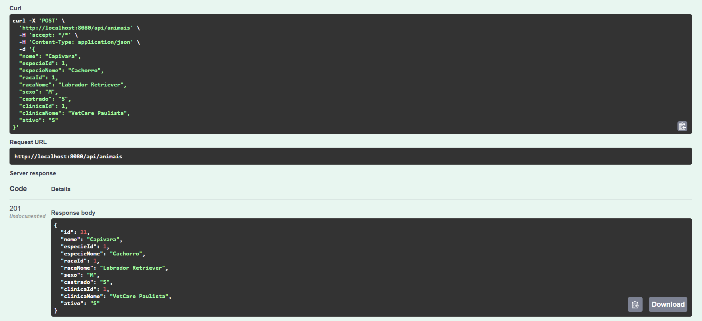
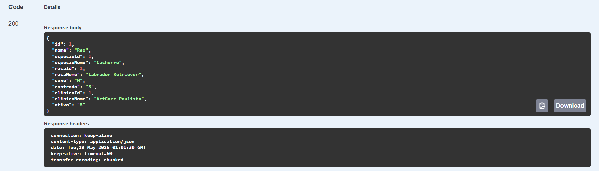
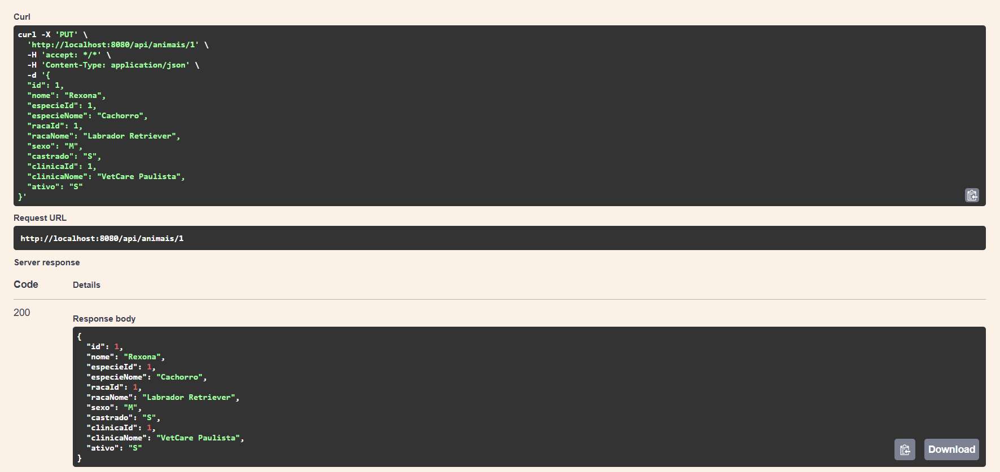
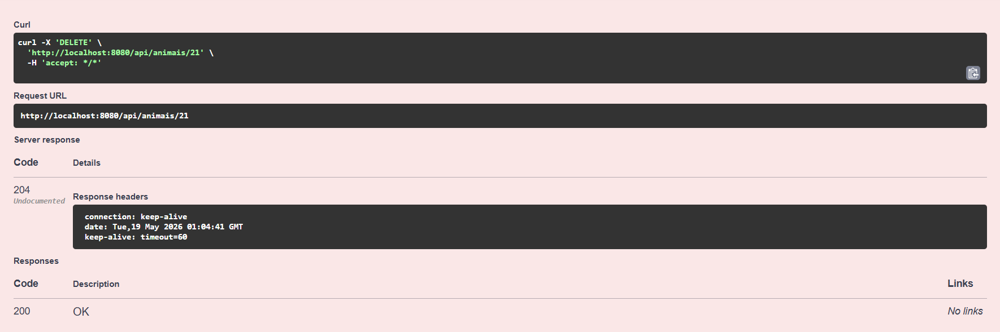
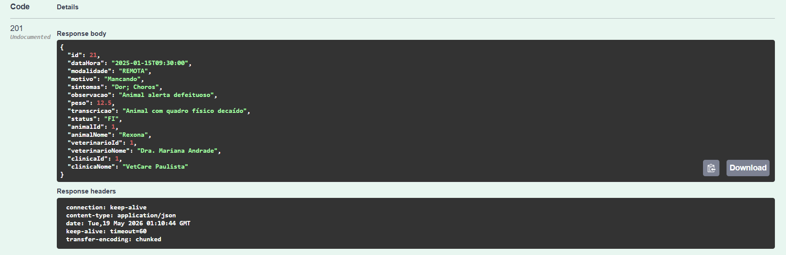
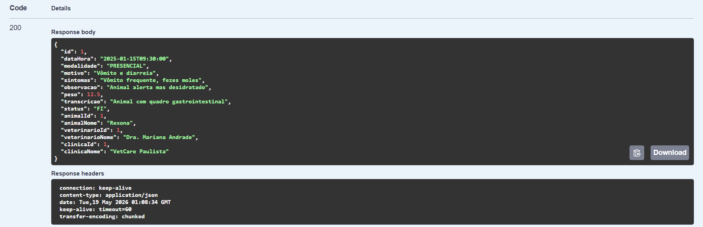
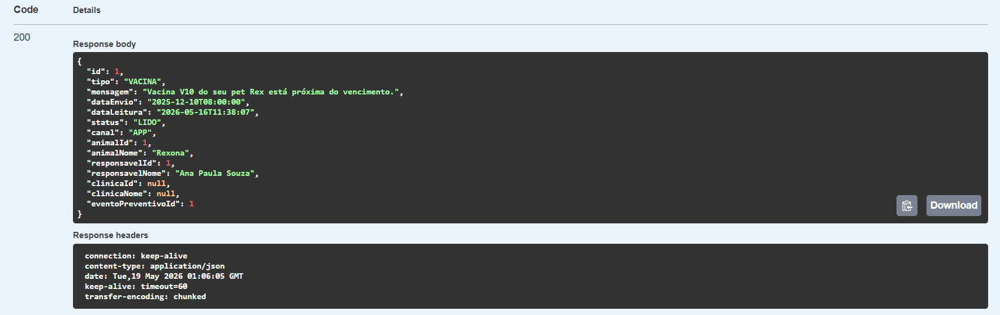
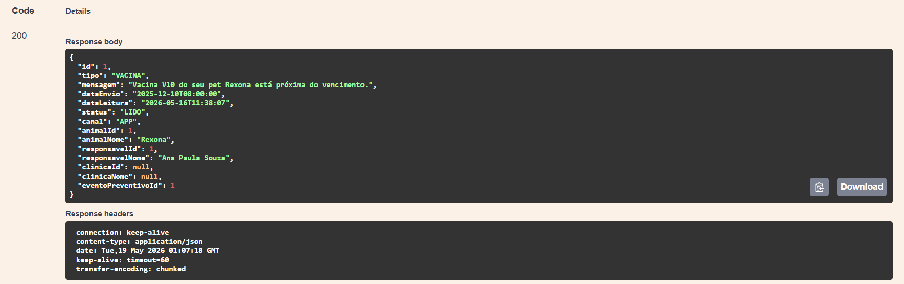

# Arkive API

API REST desenvolvida para o **Challenge FIAP 2026**, em parceria com a **CLYVO VET**.

O **Arkive** é uma solução voltada à continuidade da jornada de saúde do pet. A proposta é apoiar clínicas, veterinários, responsáveis e instituições no registro e acompanhamento de eventos clínicos, preventivos, terapêuticos e de bem-estar, criando uma base estruturada para histórico longitudinal e futuras análises de dados.

---

## Integrantes

| Integrante | Responsabilidades principais |
| --- | --- |
| Gustavo | Java Advanced; DevOps Tools & Cloud Computing |
| Lucca | Mastering Relational and Non-Relational Database; Mobile Application Development |
| Rafaela | Disruptive Architectures: IoT, IoB & Generative IA; Compliance, Quality Assurance & Tests |
| Sabelli | Advanced Business Development with .NET |

---

## Objetivo do projeto

O Arkive busca resolver o problema da fragmentação da jornada de saúde do pet. Em muitos casos, o responsável só interage com a clínica em momentos pontuais, como vacinação, emergência, sintomas agudos ou retorno solicitado.

A aplicação propõe um núcleo funcional para organizar:

- cadastro de animais, responsáveis, clínicas e veterinários;
- vínculo histórico entre animais e responsáveis;
- consultas, diagnósticos, prescrições e adesão terapêutica;
- avaliações de bem-estar;
- protocolos e eventos preventivos;
- alertas internos;
- feedback NPS;
- eventos de jornada para análise futura.

---

## Tecnologias utilizadas

- Java 17
- Spring Boot 3.5.14
- Spring Web
- Spring Data JPA
- Bean Validation
- Oracle Database
- Swagger/OpenAPI com Springdoc
- Maven
- Docker e Azure serão utilizados na etapa de DevOps

---

## Estrutura do projeto

```text
src/main/java/br/com/fiap/arkive
├── config
├── controller
├── dto
│   ├── request
│   └── response
├── entity
├── exception
├── repository
└── service
```

---

## Documentação da entrega

Os principais documentos da entrega Java Advanced estão disponíveis na pasta `docs/`:

| Documento | Descrição |
|---|---|
| [Arquitetura da Solução](docs/arquitetura.md) | Explica a arquitetura da API, camadas, entidades, relacionamentos, validações, cache e Swagger. |
| [Cronograma de Desenvolvimento](docs/cronograma-desenvolvimento.md) | Apresenta a divisão de responsabilidades da equipe e o cronograma resumido de desenvolvimento. |
| [Collection Postman](docs/postman/arkive-collection.json) | Collection exportada com requisições para validar os endpoints da API. |

---

### Camadas principais

| Camada | Função |
| --- | --- |
| `controller` | Expõe os endpoints REST da API |
| `service` | Contém regras de negócio e validações |
| `repository` | Faz a comunicação com o banco via Spring Data JPA |
| `entity` | Mapeia as tabelas Oracle com JPA |
| `dto.request` | Objetos de entrada das requisições |
| `dto.response` | Objetos de saída das respostas |
| `exception` | Tratamento centralizado de erros |
| `config` | Configurações da aplicação, Swagger/OpenAPI e outros recursos |

---

## Perfis da aplicação

A aplicação possui dois perfis principais.

### Perfil `local-nodb`

Perfil utilizado para iniciar a aplicação sem conexão com banco de dados. Ele serve principalmente para validar a inicialização básica da aplicação e o endpoint de saúde.

```powershell
.\mvnw.cmd spring-boot:run "-Dspring-boot.run.profiles=local-nodb"
```

Endpoint para teste:

```http
GET http://localhost:8080/api/health
```

Resposta esperada:

```json
{
  "status": "UP",
  "application": "Arkive API"
}
```

### Perfil `oracle`

Perfil utilizado para executar a aplicação conectada ao banco Oracle do projeto.

```powershell
.\mvnw.cmd spring-boot:run "-Dspring-boot.run.profiles=oracle"
```

O arquivo utilizado para esse perfil é:

```text
src/main/resources/application-oracle.properties
```

As credenciais e URLs devem ser fornecidas por variaveis de ambiente. Nao commite credenciais reais.

A aplicação utiliza:

```properties
spring.jpa.hibernate.ddl-auto=validate
```

Isso significa que o Hibernate **valida** o schema existente, mas não cria, altera ou remove tabelas automaticamente.

---

## Build do projeto

Para compilar o projeto e executar os testes:

```powershell
.\mvnw.cmd clean package
```

---

## Executando a aplicação

### Sem banco de dados

```powershell
.\mvnw.cmd spring-boot:run "-Dspring-boot.run.profiles=local-nodb"
```

### Com Oracle

```powershell
.\mvnw.cmd spring-boot:run "-Dspring-boot.run.profiles=oracle"
```

Após iniciar a aplicação, acesse:

```text
http://localhost:8080/api/health
```

---

## Swagger / OpenAPI

Com a aplicação em execução, a documentação Swagger pode ser acessada em:

```text
http://localhost:8080/swagger-ui/index.html
```

A especificação OpenAPI em JSON pode ser acessada em:

```text
http://localhost:8080/v3/api-docs
```

## API

A API REST fica sob `/api/**` e usa autenticação Spring Security com HTTP Basic para clientes REST. O endpoint `/api/health` e a documentação Swagger/OpenAPI ficam públicos; os demais endpoints de API exigem usuário autenticado e aplicam escopo por perfil e recurso quando o fluxo clínico exige.

Principais perfis:

- `SYSADMIN`: leitura administrativa global.
- `ADMIN_CLINICA`: leitura administrativa da própria clínica.
- `VETERINARIO`: escrita clínica apenas nas próprias consultas, além de cadastro e correção básica de pacientes ativos da própria clínica.
- `RESPONSAVEL`: acesso aos animais vinculados e registro da própria adesão.

Status de consulta:

- `AG`: Agendada.
- `EP`: Em Progresso.
- `AP`: Aguardando Parecer.
- `FI`: Finalizada.
- `CA`: Cancelada.

## Fluxo de Consulta Assistida

Fluxo principal:

```text
AG -> EP -> narrativa -> suporte clinico por IA -> AP -> conclusao veterinaria -> FI
```

Endpoints de comando:

```http
POST  /api/consultas/{id}/iniciar
PATCH /api/consultas/{id}/narrativa
POST  /api/consultas/{id}/suporte-clinico
GET   /api/consultas/{id}/suporte-clinico
POST  /api/consultas/{id}/finalizar
POST  /api/consultas/{id}/cancelar
```

O suporte clínico por IA é investigativo e provisório. Ele não substitui a conclusão do veterinário, não confirma diagnóstico e não prescreve medicamentos. A finalização da consulta cria a conclusão veterinária confirmada.

## Transcrição de Áudio

A API expõe um gateway seguro para converter áudio clínico em texto editável antes do fluxo de narrativa da consulta. A transcrição não cria consulta, não persiste narrativa, não chama o motor clínico, não cria diagnóstico e não cria prescrição.

O endpoint usa Azure Speech SDK com reconhecimento contínuo de arquivo e `PhraseListGrammar`, compatível com recurso Azure Speech Free F0. A transcrição rápida não é usada nesta branch porque as quotas atuais da Microsoft indicam que Fast Transcription não está disponível no F0.

O contrato público aceita o áudio normal do Expo em Android/iOS (`M4A/AAC`) e também `WAV` para testes manuais. Arquivos compactados são convertidos de forma transitória no servidor para PCM WAV antes de serem enviados ao SDK. O áudio não é persistido.

Contrato:

```http
POST /api/transcricoes
Content-Type: multipart/form-data
Authorization: Basic ...
```

Campos multipart:

```text
audio=<arquivo M4A/AAC ou WAV>
idioma=pt-BR | en-US
```

`idioma` é opcional e assume `pt-BR` quando omitido. A resposta é:

```json
{
  "transcricao": "Paciente canino...",
  "idioma": "pt-BR"
}
```

Exemplo seguro:

```bash
curl -u "VET_USERNAME:VET_PASSWORD" \
  -X POST \
  -F "audio=@consulta.m4a" \
  -F "idioma=pt-BR" \
  https://arkive-b7v2.onrender.com/api/transcricoes
```

Limites e formato:

- Formatos aceitos: `M4A`/`MP4` com AAC, `AAC` e `WAV`.
- Arquivos `WAV` devem possuir cabeçalho `RIFF/WAVE`.
- Arquivos `M4A`/`AAC` são convertidos no servidor com FFmpeg para PCM WAV 16 kHz, mono, 16 bits.
- O limite configurado é `10MB` por arquivo e `11MB` por requisição multipart.
- O reconhecimento usa `startContinuousRecognitionAsync` e acumula apenas eventos finais `RecognizedSpeech`.
- O tempo limite configurado para reconhecimento é `120s`, adequado ao ditado clínico esperado de 30 a 90 segundos.
- O tempo limite configurado para conversão é `30s`.
- A concorrência local foi limitada a `1` requisição por vez para respeitar o Free F0.

Render/Docker:

- A imagem Docker usa runtime Ubuntu Jammy (`eclipse-temurin:17-jre-jammy`), alinhado às distribuições Linux suportadas pelo Azure Speech SDK para Java.
- A imagem instala `ffmpeg`, `ca-certificates`, `libasound2` e `libssl3`.
- Em runtime nativo do Render, `ffmpeg` já faz parte das ferramentas disponíveis; em Docker, a dependência fica explícita no `Dockerfile`.

Frases veterinárias usadas para bias de reconhecimento ficam em:

```text
src/main/resources/azure-speech-veterinary-phrases.txt
```

O peso inicial configurado para a lista é `1.3`.

## Fluxo de Prescrição e Adesão

Fluxo principal:

```text
consulta FI -> prescricao veterinaria -> adesao do responsavel -> acompanhamento pelo veterinario
```

Endpoints principais:

```http
POST /api/prescricoes
GET  /api/prescricoes
GET  /api/prescricoes/{id}
PUT  /api/prescricoes/{id}
DELETE /api/prescricoes/{id}

POST /api/adesoes-prescricao
GET  /api/adesoes-prescricao
GET  /api/adesoes-prescricao/{id}
```

Prescrições são criadas exclusivamente pelo veterinário responsável e somente para consultas `FI`. A adesão é registrada pelo responsável vinculado ao animal. Em adesão, o cliente informa apenas `prescricaoId`, `tomou` (`S` ou `N`) e `observacao`; responsável, animal e data do registro são definidos pelo servidor.

## Primeiro Acesso

Contas de clínica e veterinário provisionadas automaticamente usam:

- login inicial: e-mail cadastrado.
- senha inicial: e-mail cadastrado.
- primeiro login: troca de senha obrigatória.

As senhas armazenadas são hashes BCrypt. A senha temporária existe apenas para o fluxo inicial de acesso e deve ser substituída no primeiro login.

## Configuração

Variáveis de ambiente esperadas para execução com Oracle:

```properties
SPRING_PROFILES_ACTIVE=oracle
ARKIVE_DB_URL=jdbc:oracle:thin:@...
ARKIVE_DB_USERNAME=...
ARKIVE_DB_PASSWORD=...
ARKIVE_CLINICAL_ENGINE_URL=https://...
ARKIVE_JPA_SHOW_SQL=false
AZURE_SPEECH_ENDPOINT=
AZURE_SPEECH_API_KEY=
```

Em desenvolvimento local, configure `AZURE_SPEECH_ENDPOINT` e `AZURE_SPEECH_API_KEY` como variáveis de ambiente do sistema, terminal ou Run Configuration da IDE. Não commite valores reais.

Bootstrap opcional de SysAdmin:

```properties
ARKIVE_BOOTSTRAP_SYSADMIN_ENABLED=false
ARKIVE_BOOTSTRAP_SYSADMIN_NAME=...
ARKIVE_BOOTSTRAP_SYSADMIN_LOGIN=...
ARKIVE_BOOTSTRAP_SYSADMIN_PASSWORD=...
```

---

## Principais módulos da API

### 1. Cadastros básicos

Recursos principais:

```http
/api/especies
/api/racas
/api/clinicas
/api/veterinarios
/api/responsaveis
/api/animais
```

Esses endpoints permitem cadastrar e consultar os dados estruturais da aplicação.

Para veterinários, a listagem geral de animais preserva o histórico já atendido pelo profissional. Para buscar pacientes ativos disponíveis na clínica do veterinário autenticado antes de criar uma nova consulta, use:

```http
GET /api/animais/clinica
```

Esse endpoint aceita filtros por `nome`, `especieId` e `racaId`. O backend deriva a clínica pelo vínculo do veterinário autenticado e não expõe animais de outras clínicas.

---

### 2. Vínculo entre animal e responsável

```http
/api/animais-responsaveis
```

Permite vincular um animal a um ou mais responsáveis, mantendo histórico do vínculo.

Esse modelo permite que um animal exista sem responsável obrigatório no momento do cadastro, atendendo cenários B2B e institucionais, como clínicas, hospitais, ONGs, abrigos e zoológicos.

---

### 3. Jornada clínica

```http
/api/consultas
/api/diagnosticos
/api/prescricoes
/api/adesoes-prescricao
```

Permite registrar consultas, diagnósticos, prescrições e adesão terapêutica.

---

### 4. Prevenção, bem-estar e relacionamento

```http
/api/avaliacoes-bem-estar
/api/protocolos-preventivos
/api/eventos-preventivos
/api/alertas
/api/feedbacks-nps
```

Esses endpoints cobrem o acompanhamento preventivo, registros de bem-estar, alertas e satisfação do responsável.

---

### 5. Eventos de jornada

```http
/api/eventos-jornada
/api/eventos-jornada/animal/{animalId}/timeline
```

A tabela de eventos de jornada registra ações relevantes do sistema e prepara a aplicação para futuras análises e indicadores.

Eventos registrados automaticamente:

- `ANIMAL_CADASTRADO`
- `RESPONSAVEL_VINCULADO`
- `CONSULTA_CRIADA`
- `PRESCRICAO_CRIADA`
- `ADESAO_REGISTRADA`
- `AVALIACAO_BEM_ESTAR_REGISTRADA`
- `EVENTO_PREVENTIVO_CRIADO`
- `ALERTA_LIDO`
- `NPS_RESPONDIDO`

---

## Recursos técnicos implementados

A API implementa os principais requisitos técnicos da disciplina de Java Advanced:

- API REST com Spring Boot;
- entidades JPA mapeadas para Oracle;
- relacionamentos entre entidades;
- DTOs de entrada e saída;
- Bean Validation;
- tratamento centralizado de exceções;
- paginação;
- ordenação;
- filtros por parâmetros;
- cache simples em recursos de catálogo;
- documentação Swagger/OpenAPI;
- integração com Oracle;
- validação do schema com `ddl-auto=validate`.

---

## Paginação e ordenação

Os endpoints de listagem aceitam parâmetros de paginação e ordenação.

Exemplo:

```http
GET /api/animais?page=0&size=10&sort=nome,asc
```

---

## Fluxo recomendado de teste

Para validar o fluxo principal da API, recomenda-se executar as operações nesta ordem:

1. Criar uma espécie.
2. Criar uma raça vinculada à espécie.
3. Criar uma clínica.
4. Criar um veterinário.
5. Criar um responsável.
6. Criar um animal sem responsável obrigatório.
7. Vincular o responsável ao animal.
8. Criar uma consulta `AG` para o animal.
9. Iniciar a consulta (`AG -> EP`).
10. Registrar narrativa clínica.
11. Solicitar suporte clínico por IA (`EP -> AP`).
12. Finalizar a consulta com conclusão veterinária (`AP -> FI`).
13. Criar uma prescrição para a consulta `FI`.
14. Registrar adesão à prescrição.
15. Registrar avaliação de bem-estar.
16. Criar um protocolo preventivo.
17. Criar um evento preventivo.
18. Criar um alerta.
19. Marcar o alerta como lido.
20. Registrar feedback NPS.
21. Consultar a timeline de eventos do animal.

---

## Exemplos de rotas por recurso

Os cadastros administrativos ainda seguem o padrão REST convencional. Os fluxos clínicos e de prescrição usam comandos de domínio específicos quando há regras de autorização ou transição.

```http
POST   /api/recurso
GET    /api/recurso
GET    /api/recurso/{id}
PUT    /api/recurso/{id}
DELETE /api/recurso/{id}
```
---

## Evidências dos endpoints de animais

<details>
  <summary><strong>POST /api/animais</strong></summary>

  <p align="center">
    
  </p>
</details>

<details>
  <summary><strong>GET /api/animais</strong></summary>

  <p align="center">
    
  </p>
</details>

<details>
  <summary><strong>PUT /api/animais/{id}</strong></summary>

  <p align="center">
    
  </p>
</details>

<details>
  <summary><strong>DELETE /api/animais/{id}</strong></summary>

  <p align="center">
    
  </p>
</details>

### Evidências dos endpoints de consultas

<details>
  <summary><strong>POST /api/consultas</strong></summary>

  <p align="center">
    
  </p>
</details>

<details>
  <summary><strong>GET /api/consultas</strong></summary>

  <p align="center">
    
  </p>
</details>

### Evidências dos endpoints de alertas

<details>
  <summary><strong>GET /api/alertas</strong></summary>

  <p align="center">
    
  </p>
</details>

<details>
  <summary><strong>PUT /api/alertas/{id}</strong></summary>

  <p align="center">
    
  </p>
</details>

---

## Status da entrega Java Advanced


A API entrega um núcleo funcional da aplicação Arkive, com:

- cadastros principais;
- jornada clínica;
- prevenção;
- bem-estar;
- alertas;
- NPS;
- eventos de jornada;
- persistência em Oracle;
- Swagger;
- cache;
- validações;
- tratamento de erros;
- endpoints testáveis.

---
