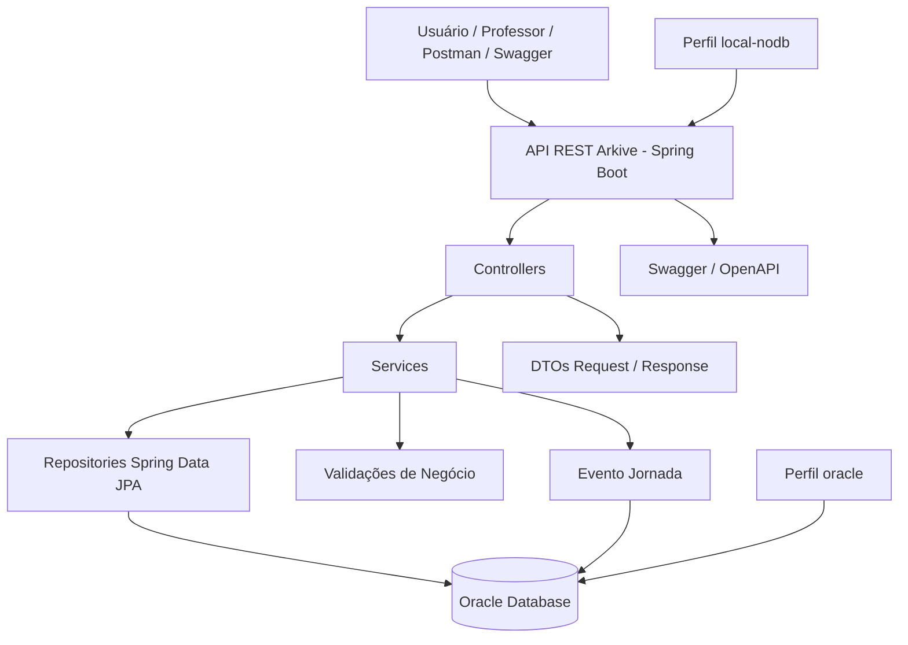
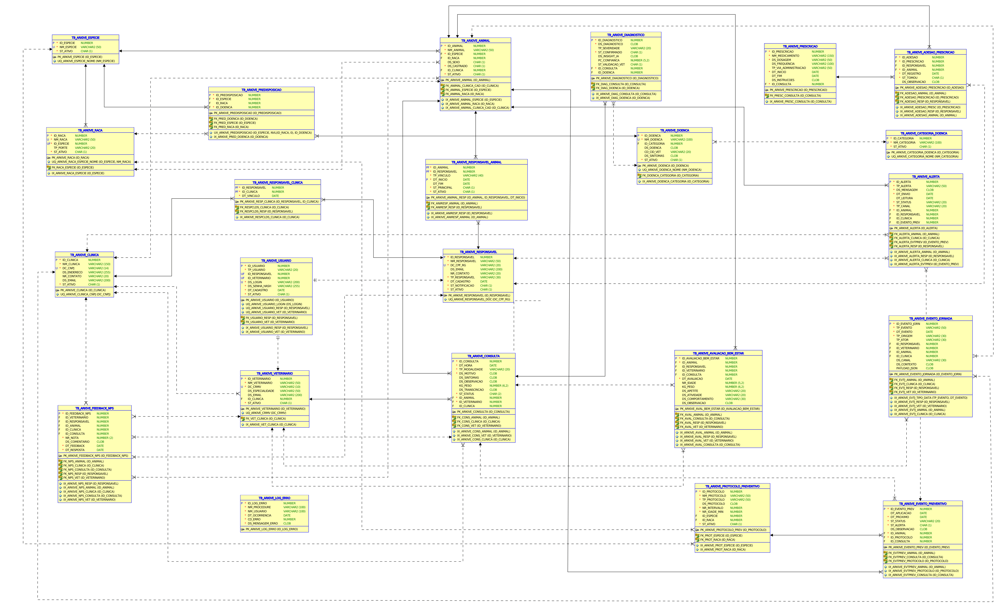

# Arquitetura da Solução — Arkive API

Este documento descreve a arquitetura da API Java do projeto Arkive, desenvolvida para o Challenge FIAP 2026 — CLYVO VET.

A aplicação foi construída em **Java 17** com **Spring Boot**, utilizando **API REST**, **JPA/Hibernate**, **Oracle Database**, **DTOs**, **Bean Validation**, **Swagger/OpenAPI**, paginação, busca por parâmetros, cache simples e tratamento centralizado de exceções.

---

## 1. Visão geral da arquitetura

O Arkive foi desenvolvido como uma API REST responsável por registrar e consultar dados da jornada contínua de saúde do pet.

A arquitetura segue uma divisão simples em camadas:

```text
Cliente / Swagger / Postman
        ↓
Controller
        ↓
Service
        ↓
Repository
        ↓
Oracle Database
```

Essa estrutura mantém a aplicação organizada, separando responsabilidades entre entrada HTTP, regras de negócio, acesso a dados e persistência.

---

## 2. Diagrama macro da arquitetura



---

## 3. Camadas da aplicação

| Camada       | Pacote                            | Responsabilidade                                            |
| ------------ | --------------------------------- | ----------------------------------------------------------- |
| Controller   | `br.com.fiap.arkive.controller`   | Recebe requisições HTTP e expõe os endpoints REST           |
| Service      | `br.com.fiap.arkive.service`      | Executa regras de negócio, validações e orquestra operações |
| Repository   | `br.com.fiap.arkive.repository`   | Realiza acesso ao banco usando Spring Data JPA              |
| Entity       | `br.com.fiap.arkive.entity`       | Representa as tabelas Oracle com JPA                        |
| DTO Request  | `br.com.fiap.arkive.dto.request`  | Representa os dados recebidos pela API                      |
| DTO Response | `br.com.fiap.arkive.dto.response` | Representa os dados retornados pela API                     |
| Exception    | `br.com.fiap.arkive.exception`    | Centraliza o tratamento de erros                            |
| Config       | `br.com.fiap.arkive.config`       | Configurações como Swagger/OpenAPI                          |

---

## 4. Tecnologias utilizadas

| Tecnologia         | Uso no projeto                        |
| ------------------ | ------------------------------------- |
| Java 17            | Linguagem principal                   |
| Spring Boot 3.5.14 | Framework principal da aplicação      |
| Spring Web         | Criação da API REST                   |
| Spring Data JPA    | Persistência e repositórios           |
| Hibernate          | Implementação JPA                     |
| Oracle Database    | Banco relacional oficial              |
| Bean Validation    | Validação dos DTOs                    |
| Swagger/OpenAPI    | Documentação dos endpoints            |
| Maven              | Gerenciamento de dependências e build |
| Spring Cache       | Cache simples em recursos de catálogo |

---

## 5. Perfis da aplicação

A aplicação possui dois perfis principais.

### 5.1 Perfil `local-nodb`

Usado para iniciar a aplicação sem conexão com banco de dados.

```powershell
.\mvnw.cmd spring-boot:run "-Dspring-boot.run.profiles=local-nodb"
```

Esse perfil mantém disponível o endpoint:

```http
GET /api/health
```

### 5.2 Perfil `oracle`

Usado para executar a aplicação conectada ao banco Oracle.

```powershell
.\mvnw.cmd spring-boot:run "-Dspring-boot.run.profiles=oracle"
```

Nesse perfil, o Hibernate utiliza:

```properties
spring.jpa.hibernate.ddl-auto=validate
```

Ou seja, a aplicação valida o schema Oracle existente, mas **não cria, altera ou remove tabelas automaticamente**.

---

## 6. Organização dos pacotes

```text
src/main/java/br/com/fiap/arkive
├── ArkiveApplication.java
├── config
│   └── OpenApiConfig.java
├── controller
├── dto
│   ├── request
│   └── response
├── entity
├── exception
├── repository
└── service
```

---

## 7. Principais entidades de domínio

| Entidade              | Descrição                                              |
| --------------------- | ------------------------------------------------------ |
| `Especie`             | Catálogo de espécies animais                           |
| `Raca`                | Catálogo de raças vinculadas a espécies                |
| `Clinica`             | Clínica ou hospital veterinário parceiro               |
| `Veterinario`         | Profissional responsável por atendimentos              |
| `Responsavel`         | Pessoa ou instituição relacionada ao cuidado do animal |
| `Animal`              | Entidade central da jornada do pet                     |
| `AnimalResponsavel`   | Vínculo histórico entre animal e responsável           |
| `Consulta`            | Registro de atendimento veterinário                    |
| `Diagnostico`         | Diagnóstico associado a uma consulta                   |
| `Prescricao`          | Tratamento ou medicamento prescrito                    |
| `AdesaoPrescricao`    | Registro de adesão terapêutica                         |
| `AvaliacaoBemEstar`   | Registro de peso, apetite, atividade e comportamento   |
| `ProtocoloPreventivo` | Modelo de vacina, check-up ou protocolo preventivo     |
| `EventoPreventivo`    | Evento preventivo planejado ou realizado               |
| `Alerta`              | Alerta interno para acompanhamento                     |
| `FeedbackNps`         | Registro de satisfação em escala NPS                   |
| `EventoJornada`       | Evento de negócio para histórico longitudinal          |
| `Doenca`              | Entidade de referência usada em diagnósticos           |

---

## 8. Diagrama de Entidades

<p align="center">
  
</p>

## 9. Principais relacionamentos

### 9.1 Espécie, raça e animal

Uma espécie pode possuir várias raças. Um animal sempre pertence a uma espécie e pode ou não possuir uma raça cadastrada.

Regras aplicadas:

- Animal exige espécie obrigatória.
- Raça é opcional.
- Quando uma raça é informada, ela deve pertencer à espécie escolhida.

### 9.2 Animal e responsável

O animal não exige responsável obrigatório no cadastro. Isso permite cenários B2B e institucionais, como animais cadastrados por clínicas, hospitais, ONGs, abrigos ou zoológicos.

A relação entre animal e responsável é feita pela entidade `AnimalResponsavel`, que registra:

- animal;
- responsável;
- tipo de vínculo;
- data de início;
- data de fim;
- responsável principal;
- status ativo.

### 9.3 Jornada clínica

A jornada clínica é composta por:

- `Consulta`;
- `Diagnostico`;
- `Prescricao`;
- `AdesaoPrescricao`.

Uma consulta pertence a um animal e a um veterinário. A clínica é opcional, permitindo atendimento autônomo.

Uma prescrição pertence a uma consulta, e a adesão registra se o tratamento foi seguido ou não.

### 9.4 Bem-estar e prevenção

A aplicação permite registrar informações recorrentes de bem-estar do animal, como:

- peso;
- idade;
- apetite;
- atividade;
- comportamento;
- observações gerais.

Também permite cadastrar protocolos preventivos e criar eventos preventivos para animais específicos.

### 9.5 Alertas e NPS

Os alertas são registros internos para acompanhamento de ações como vacina, retorno, medicamento e check-up.

O feedback NPS permite registrar satisfação vinculada a veterinário, responsável, animal, clínica ou consulta.

### 9.6 Eventos de jornada

A entidade `EventoJornada` registra eventos relevantes da jornada do pet.

Eventos registrados automaticamente:

| Evento                           | Momento de geração                            |
| -------------------------------- | --------------------------------------------- |
| `ANIMAL_CADASTRADO`              | Quando um animal é criado                     |
| `RESPONSAVEL_VINCULADO`          | Quando um responsável é vinculado a um animal |
| `CONSULTA_CRIADA`                | Quando uma consulta é criada                  |
| `PRESCRICAO_CRIADA`              | Quando uma prescrição é criada                |
| `ADESAO_REGISTRADA`              | Quando uma adesão à prescrição é registrada   |
| `AVALIACAO_BEM_ESTAR_REGISTRADA` | Quando uma avaliação de bem-estar é criada    |
| `EVENTO_PREVENTIVO_CRIADO`       | Quando um evento preventivo é criado          |
| `ALERTA_LIDO`                    | Quando um alerta é marcado como lido          |
| `NPS_RESPONDIDO`                 | Quando um feedback NPS é registrado           |

Esses eventos ajudam a construir uma visão longitudinal da jornada do animal.

---

## 10. Constraints e validações

A aplicação utiliza validações tanto no banco Oracle quanto na camada Java.

### 10.1 Validações no banco

O banco possui constraints como:

- chaves primárias;
- chaves estrangeiras;
- valores permitidos em campos de status;
- validação de datas;
- validação de campos `CHAR(1)`;
- validação de campos `CHAR(2)`;
- validação de JSON em `PAYLOAD_JSON`.

### 10.2 Validações na aplicação

A API utiliza Bean Validation nos DTOs para validar dados de entrada, como:

- campos obrigatórios;
- tamanho de textos;
- valores positivos;
- e-mails;
- notas NPS entre 0 e 10;
- campos de domínio como status, tipo, canal e modalidade.

### 10.3 Regras de negócio na camada Service

Algumas validações dependem de consulta ao banco ou de comparação entre entidades, por isso ficam na camada de serviço.

Exemplos:

- verificar se uma raça pertence à espécie informada;
- verificar se uma prescrição pertence ao mesmo animal da adesão;
- validar existência de animal, responsável, veterinário e clínica;
- impedir datas finais anteriores às datas iniciais;
- registrar eventos de jornada após ações importantes.

---

## 11. Tratamento de erros

O projeto possui tratamento centralizado de exceções em `GlobalExceptionHandler`.

Principais tipos de erro:

| Situação                  | Resposta esperada |
| ------------------------- | ----------------- |
| Recurso não encontrado    | 404               |
| Erro de validação         | 400               |
| Regra de negócio inválida | 400 ou 409        |
| Erro inesperado           | 500               |

As respostas de erro seguem um formato padronizado com informações como:

- data/hora;
- status HTTP;
- erro;
- mensagem;
- caminho da requisição.

---

## 12. Cache

O projeto utiliza cache simples com Spring Cache.

O cache foi aplicado em consultas de catálogo e leitura simples, como:

- espécies;
- raças;
- clínicas;
- protocolos preventivos.

Operações de criação, atualização e exclusão invalidam os caches relacionados.

---

## 13. Swagger/OpenAPI

A API possui documentação automática com Swagger/OpenAPI.

Com a aplicação em execução, acessar:

```text
http://localhost:8080/swagger-ui/index.html
```

A especificação JSON fica disponível em:

```text
http://localhost:8080/v3/api-docs
```

---

## 14. Diagrama MER

O MER oficial do projeto é produzido na disciplina de **Mastering Relational and Non-Relational Database**, com base no schema Oracle `TB_ARKIVE_*`.

<p align="center">
  
</p>

---

## 15. Conclusão

A arquitetura do Arkive foi projetada para ser simples, modular e compatível com os requisitos da disciplina de Java Advanced.

A solução demonstra:

- uso de Spring Boot;
- API REST;
- persistência em Oracle;
- entidades JPA relacionadas;
- DTOs;
- validações;
- tratamento de exceções;
- cache;
- Swagger;
- busca, paginação e ordenação;
- registro de eventos de jornada.

Essa estrutura permite demonstrar um MVP funcional para a continuidade da saúde do pet, mantendo espaço para evolução futura em autenticação, dashboards, integração com WhatsApp, IA real e analytics.
